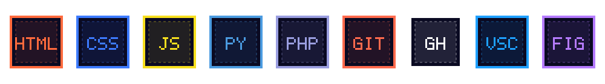

 

### 🪙 *"Software yang hebat lahir dari tim yang saling percaya."*

## 🕹️ Player Select

## 🍒 Power-Ups

## 🗺️ Level Select

Setiap proyek melewati enam level siklus hidup pengembangan perangkat lunak (SDLC).

## 👾 Co-op Mode

Empat pemain, empat cabang, satu boss: merge ke `main` dan rilis versi 1.0.

## 🎒 Inventory

## 📜 Misi Kami

**Kelompok 1** adalah tim beranggotakan empat pemain yang menyusun profil ini sebagai bagian dari
tugas mata kuliah **Rekayasa Perangkat Lunak**. Kami belajar merancang, membangun, dan mengelola
perangkat lunak secara terstruktur, dengan kolaborasi sebagai kekuatan utama.

<!--
  OPSIONAL - Daftar Misi/Proyek. Hapus tanda komentar ini kalau proyek kelompok sudah siap.

## 🏆 Quest Aktif

| Quest | Deskripsi | Link |
|:---|:---|:---:|
| Nama Proyek | Deskripsi singkat proyek | [Mulai](https://github.com/NAMA-ORG/NAMA-REPO) |

-->

 

